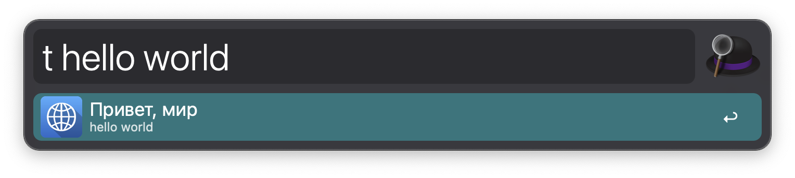
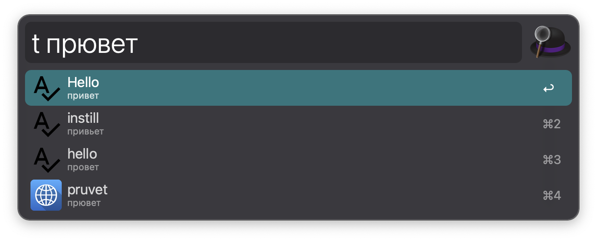

    
    
    
      
           

# Alfred Workflow Translate RU-EN EN-RU

Convenient translation of texts in en-ru ru-en directions.

Fork https://github.com/podgorniy/alfred-translate

---

The main idea remains the same. But for this workflow to work correctly, it was necessary to rewrite the entire script due to the limitations of the Yandex API, which can now only translate one word.
The script was rewritten in JS, and the Yandex Translator API was removed in favor of the Google Translate API.

---

## Features

- Translates Russian text into English. English text to Russian. You do not need to indicate the direction of the translation.
- Works with both input text and selected text.
- Shows translation options for one word.
- Spell check for one word.
- Translates both words and sentences.
- Copies the translation result to the clipboard.

## Installation

#### Requirements

- MacOS 12.4 and above
- Requires node at least version 14
- Internet connection
- Alfred Powerpack

#### Download and import

1. Download the latest version from [the releases page](https://github.com/Mikage777/alfred-translate/releases).
2. Import the downloaded file to Alfred.

#### Commands

Translation of a word, starting from Alfred string on the keyword: `t` or `e`:

Hotkey to call: `Option ⌥ + Command ⌘ + T`
